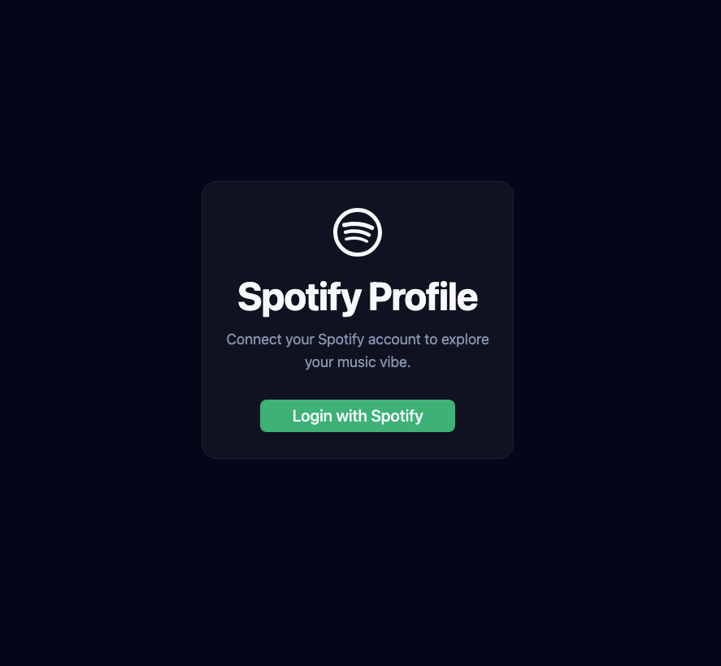
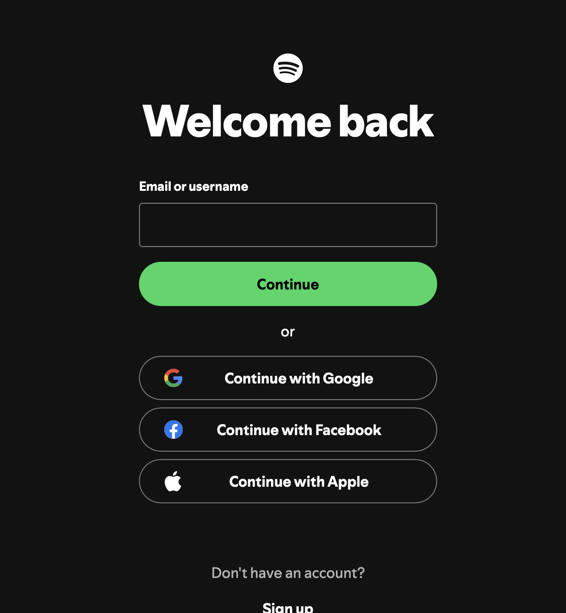
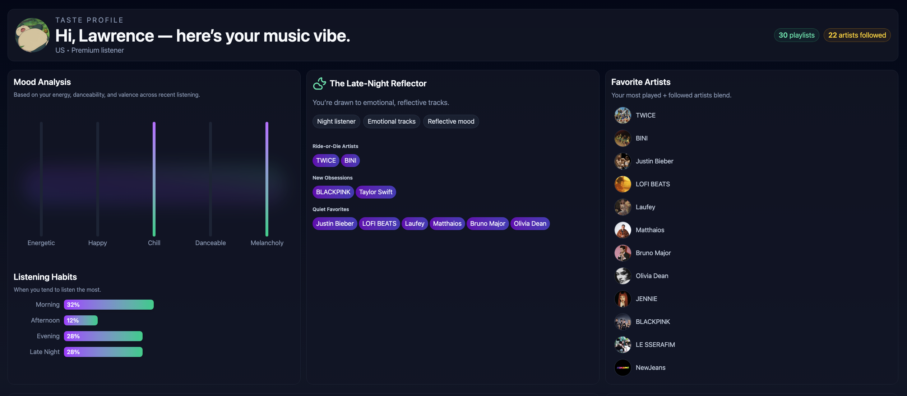
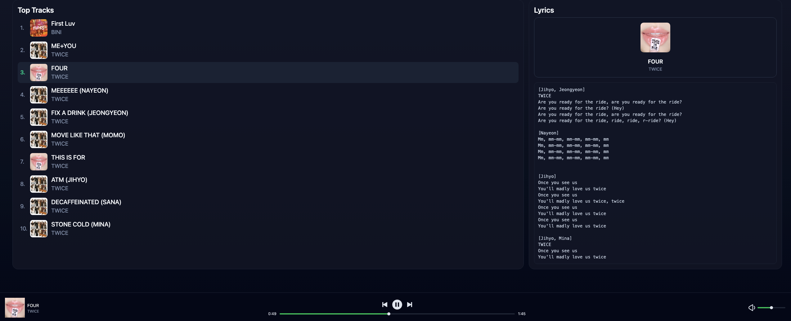

# Spotify Profile App

**Live Demo:** [Spotify - Taste Profile](https://spotify-profile-3zsu.onrender.com/)

## Project Overview

This project is a Spotify-inspired music profile app, built to combine my interests in music and front-end development. While it’s not a direct clone, it offers a familiar experience for users to explore their listening habits, favorite artists, and top tracks.

### Technologies Used

- **Front-End:**
  - **React** with **Tailwind CSS** and **ShadCN** for rapid, clean UI development.
  - **spotify-web-player** for seamless music playback with a familiar interface.
- **Back-End:**
  - **Node.js** with **spotify-web-api-node** for easy authentication and data fetching from Spotify.
  - **TanStack Query** for efficient server data management and caching.
- **Development Tools:**
  - **ChatGPT** was invaluable for debugging, brainstorming, and accelerating development.

## Reflection

I chose this as my Level 3 project because it aligns with my passion for music and front-end engineering. Using modern UI libraries allowed me to focus on features and user experience rather than building components from scratch. Integrating third-party tools like spotify-web-player and leveraging ChatGPT made the process smoother and more enjoyable.

## Challenges

- Some of Spotify's API calls are deprecated, and Spotify is restrictive on the data it provides. Most of the stats are calculated based on the data the app receives, rather than Spotify providing it directly.
- Working with third-party libraries made authentication easier, but there was a learning curve during integration. One positive was that the Spotify Web Player had a great UI that fit perfectly with ShadCN and Tailwind components.

## Future Improvements

There’s still plenty of room for growth. I’d like to:

- Enhance the UI with more interactive and personalized features.
- Add a web scraper to display artist concert events or news (since Spotify’s API doesn’t provide this).
- Improve error handling and loading states for a more robust experience.
- Expand analytics and visualizations for user listening data.

Overall, I’m proud to get to work on something I’m really interested in and looking forward to improving this project even more.

## App Screenshots

1. **Connect Spotify Account**
   

2. **Spotify Login Page**
   

3. **Dashboard (Part 1)**
   

4. **Dashboard (Part 2)**
   
